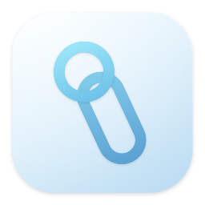
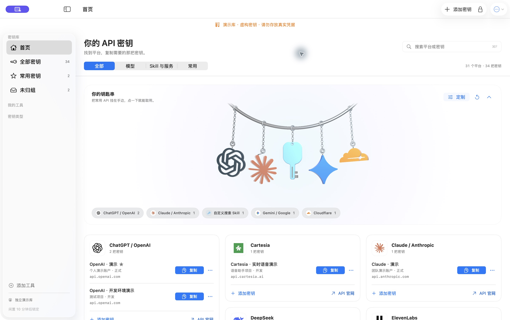
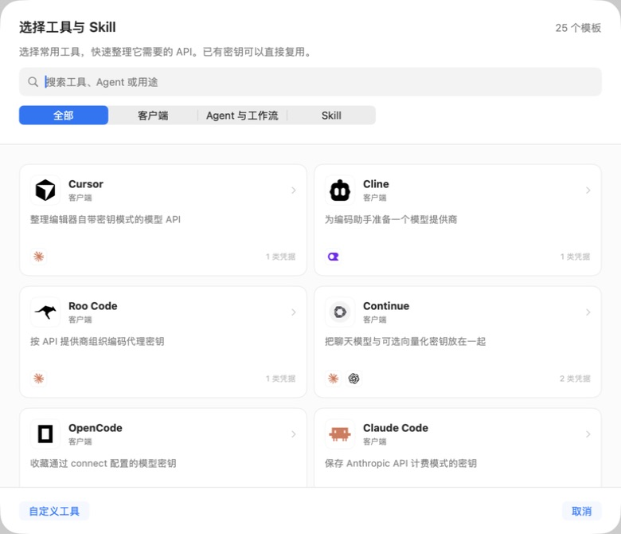

<p align="center">
  
</p>
<h1 align="center">Keynest</h1>
<p align="center"><strong>Keep your API keys together on your Mac.</strong></p>
<p align="center">Local encryption · Touch ID · Find a provider, copy a key</p>

<p align="center">
  <a href="https://github.com/kody1126/Keynest/releases/tag/v0.10.0"></a>
  
  <a href="https://github.com/kody1126/Keynest/actions/workflows/checks.yml"></a>
  <a href="LICENSE"></a>
</p>

<p align="center">
  <strong><a href="https://github.com/kody1126/Keynest/releases/download/v0.10.0/Keynest-0.10.0-arm64.dmg">Download for macOS</a></strong>
  · <a href="README.md">简体中文</a>
  · <a href="docs/guide.en.md">User guide</a>
  · <a href="https://github.com/kody1126/Keynest/issues">Report an issue</a>
</p>

<p align="center">Apple Silicon · Chinese interface · Free and open source</p>

<p align="center">
  
</p>
<p align="center"><sub>Actual app screenshot using fictional data from the separate Demo app.</sub></p>

## Find the right key, faster

One model provider can mean several keys. One Agent can need access to search, a browser, and a database. Keynest keeps these credentials in one local vault: save them once, then find the provider on Home and copy the key you need.

- **Ready when you open it** — Home cards fit their content in a compact layout, with search at the top right and a favorites filter. No need to open an editor just to copy a key.
- **Keep your APIs within reach** — A cropped metal arc holds staggered chains with individual enamel brand charms or glass keys in six colors, complementing the light interface. Click a charm to see every key for that provider, then choose the one to copy.
- **Make the keyring yours** — Click the metal clasp or **Customize (定制)** to select and reorder 0–8 charms from 61 brands and your saved custom providers, or restore automatic selection. You can still drag, reset, or collapse it.
- **Multiple keys, easy to tell apart** — Account labels, environments, and API addresses distinguish personal, team, development, and production use.
- **Choose a provider, paste your key** — 61 built-in presets cover OpenAI, Claude, Gemini, DeepSeek, Cloudflare, GitHub, and more, with brand icons and official API links.
- **Organize keys by tool** — 25 tool and Skill templates cover Cursor, Cline, Dify, n8n, and more. The same key can be linked to several tools.
- **Unlock with Touch ID** — Supported Macs can use the system fingerprint prompt, with your master password always available as a fallback.
- **Keep an encrypted backup** — Export your vault locally, or merge entries from a backup into an existing vault.

The keyring renders locally and receives only display information such as provider names, artwork, and colors; it does not hold secret values. Your selection and order are encrypted with the vault and included in encrypted backups. It respects Reduce Motion and Reduce Transparency.

<details>
<summary><strong>Explore the tool templates</strong></summary>

<p align="center">
  
</p>

Reuse existing keys for a tool or add the ones it needs. Keynest organizes credentials without automatically changing the tools' configuration. [Provider catalog](research/api-catalog-0.7.md) · [Tool templates](research/skill-agent-templates-0.7.md)

</details>

## Download and get started

**[Download Keynest 0.10.0 · Apple Silicon](https://github.com/kody1126/Keynest/releases/download/v0.10.0/Keynest-0.10.0-arm64.dmg)** · [Release notes and SHA-256 checksums](https://github.com/kody1126/Keynest/releases/tag/v0.10.0)

Requires **macOS 14 or later**. A package is available for Apple Silicon. You can try building from source on an Intel Mac, but that configuration has not been verified.

1. Open the DMG, copy `Keynest.app` to your personal `~/Applications` folder, and launch the installed app.
2. Set a master password of at least 12 characters. Enable Touch ID if your Mac supports it.
3. Choose a provider on Home, paste your API key, and save. Next time, find the key through its provider card or keyring charm and click **Copy (复制)**.

> [!IMPORTANT]
> This is a preview release with a local ad-hoc signature. It is not signed with an Apple Developer ID or notarized, so macOS may block the first launch. Download from this repository or build from source; see [Apple’s first-launch guidance](https://support.apple.com/en-us/102445). Your master password cannot be recovered; keep it safe and export encrypted backups regularly.

<details>
<summary><strong>Want to try it first? The download includes a separate Demo app</strong></summary>

Copy `Keynest Demo.app` to `~/Applications`, open it, and enter the public password **`Keynest-Demo-2026`**. No username is needed. Its **34 fictional keys and 10 tools** let you try searching, copying, adding keys, and linking them to tools.

The Demo stores its vault separately, makes no quota requests, and disables import, export, and password changes. **Do not store real credentials in the Demo.**

</details>

## Local storage, clear security boundaries

The entire vault is encrypted with **AES-256-GCM**. Its encryption key is derived from your master password using **PBKDF2-HMAC-SHA256 with 600,000 iterations and a random salt**. Touch ID unlock is protected by Apple's Secure Enclave.

- No cloud account is required, and Keynest does not initiate vault uploads or synchronization.
- The vault locks after 10 minutes of inactivity or when your Mac sleeps.
- Universal Clipboard synchronization is disabled for each copy. Keynest clears it after 30 seconds without replacing anything you copy afterward; third-party clipboard tools may still retain a copy.
- Quota queries must be enabled explicitly and refreshed manually. They currently support selected balance or usage information from DeepSeek, SiliconFlow, and OpenRouter. **There is no real-time quota synchronization across all providers.**

This project has not undergone an independent security audit. Encryption at rest cannot guarantee the safety of unlocked memory, the screen, or the clipboard if malware already controls your Mac.

[Security mechanisms and limits](docs/guide.en.md#data-and-security) · [0.8.1 review record](research/security-review-0.8.1.md) · [Report a vulnerability privately](SECURITY.md)

## Build from source

The native app uses SwiftUI and AppKit, with SceneKit rendering the Home keyring locally. There are no third-party Swift Package dependencies. You need macOS and Apple's Command Line Tools; Node.js, a full Xcode installation, and Blender are not required. Blender is used only to regenerate the bundled [3D assets](macos/Resources/KeychainArt/README.md) during development.

```sh
git clone https://github.com/kody1126/Keynest.git
cd Keynest/macos
zsh scripts/build-app.sh
zsh scripts/build-demo-app.sh
zsh scripts/install-apps.sh
```

The installer verifies and backs up existing apps without modifying your vault. Build outputs are placed in `macos/dist/apps.noindex/`; run the installed copies.

[Full build and packaging instructions](docs/guide.en.md#development-and-references) · [Testing and contributing](CONTRIBUTING.md) · [More documentation](docs/README.md)

## Contribute

Feedback, bug reports, and pull requests are welcome. Read the [contribution guide](CONTRIBUTING.md) first, and keep real keys and vaults out of public issues, screenshots, and logs. Submit security issues through [private vulnerability reporting](https://github.com/kody1126/Keynest/security/advisories/new).

## License

Original Keynest code is available under the [MIT License](LICENSE). Third-party brand icons retain their own licenses and trademark rights. Some assets from official websites have no separate open-source license and are not covered by this project's MIT license. See the [third-party notices](THIRD_PARTY_NOTICES.md).
