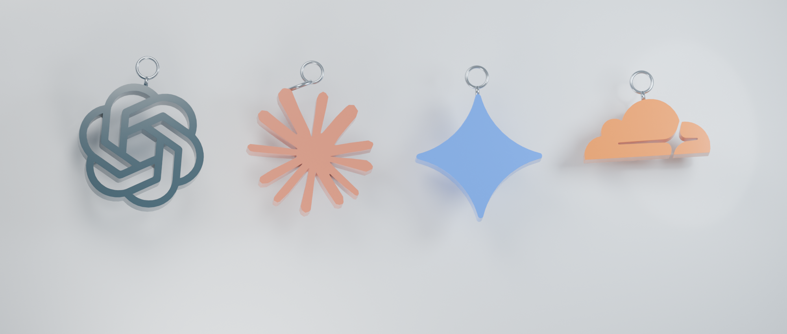
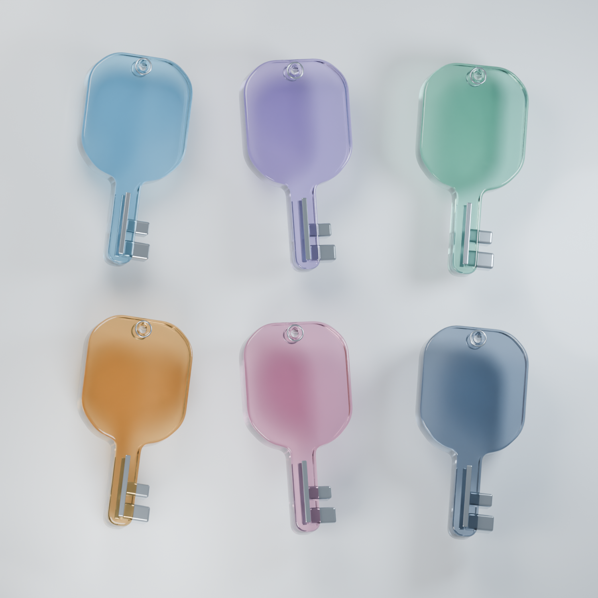

# Keynest local 3D keychain assets

Known providers use **the brand symbol itself as a thick, beveled pendant**. An unbranded/custom item uses the glass key in one of six colors. The brand charms do not have a key-shaped frame, backing plaque, or image billboard.

These are build-time assets made with **Blender 5.2.2 LTS**, locally, without downloads or user data. The JSON is consumed by the native SceneKit renderer; Blender is not required to run or build the app from the committed meshes.





## Files and runtime contract

- `glass-key-v1.mesh.json`: original generic key, continuous glass head/shaft, a real through-hole and separate metal details; 5,376 triangles.
- `charms/<provider-id>.mesh.json`: complete independent brand pendant, including a small metal suspension ring. All 61 provider IDs are listed in `manifest.json`.
- `logos/<provider-id>.mesh.json`: small relief version retained as a reusable source asset. The current brand display uses `charms`, not this relief on a key.
- `manifest.json`: generic mesh, six palettes, material suggestions, per-provider `charm`, `charmTriangles`, `mesh`, `rgba`, original PNG SHA-256, and silhouette extraction method.
- `source/glass-key-v1.blend` and `source/brand-charms-v1.blend`: editable Blender source scenes. Runtime packaging needs only the JSON assets; source scenes and previews can be excluded.
- `previews/`: actual local Blender Cycles renders plus the complete source/silhouette audit. Rendered refraction is a design reference; SceneKit's real-time material approximation is tuned separately.

The mesh schema is `schemaVersion: 1`, with `meshes: [{name, role, positions, normals, indices}]`. Positions/normals are flat XYZ arrays, and indices form counterclockwise triangles. All object transforms are baked, with finite six-decimal values and unit normals. Collinear tessellation fillers are removed.

Coordinates are right-handed, **Y up, front +Z**. Every file has the same `anchor: [0, 1, 0]`; translate geometry by minus that anchor when parenting it under a hanging joint. No other matrix or UV mapping is needed.

| Asset | Extent and placement | Roles |
| --- | --- | --- |
| Generic key | 1.12 wide × 2.20 tall; glass thickness 0.28, metal details to 0.307 | `glass`, `metal` |
| Brand pendant | Symbol longest side about 1.35; body thickness 0.22; top edge about Y=0.795; silver loop centered at Y=1 | `logo`, `metal` |
| Small reusable relief | Center `[0, 0.43, 0.167]`, longest side about 0.645; thickness 0.038 | `logo` |

Each complete brand pendant is below 15,000 triangles (the largest is 13,212). `rgba` uses **sRGB 0…1** with alpha 1; it must not be converted to linear values before constructing an sRGB color in AppKit. Opaque brand enamel with a restrained clear coat uses that representative color independently of the custom-key glass palette. Gemini `3186FF`, Claude `D97757`, Cloudflare `F38020`, DeepSeek `4D6BFE` and Hugging Face `FFD21E` match the dominant colors in the attributed source PNGs. Multicolor brands are intentionally reduced to a single representative hue in this mesh-only format; there is no claim of preserving a logo's original gradient or all painted details.

The refined contour pipeline samples at 512 pixels, retaining 640-pixel sources at 640 rather than reducing them. It traces an antialiased, subpixel threshold field and simplifies with an error tolerance of 0.125% of the sampling resolution. Shared mesh vertices are welded before applying a 0.014 **inward** edge bevel; the previous outward Curve bevel thickened fine strokes and narrowed holes. Planar front/back normals stay flat while side/bevel shading is smooth. Extra polygons are concentrated where curvature requires them, and the triangle budget is checked during generation. Low-resolution upstream favicons still limit recoverable detail; upsampling is not represented as newly recovered source information.

## Silhouette audit

[All 61 original images beside the exact extracted masks](previews/all-brand-silhouettes.png) were visually reviewed. The 14 sources that contain an opaque, nearly opaque, or gradient background are `amap`, `browserbase`, `cartesia`, `composio`, `context7`, `feishu`, `kimi`, `mem0`, `parallel`, `pinecone`, `serper`, `twilio`, `weaviate`, and `zep`. Their symbol is separated from the background; transparent padding does not bypass this step. Hugging Face additionally preserves the dark eye/mouth detail as cutouts. Other sources use their existing alpha silhouette and holes.

[The separately rendered 15-brand audit](previews/separated-brand-charms.png) checks these extracted shapes as actual 3D objects, including Cartesia's mark without its green rectangle.

The generator records each rule and the input hash, and rejects empty masks or a solid rectangle covering more than 94% of its occupied bounding box. This is an extra guard, not a substitute for reviewing a changed source image. Source images remain unchanged.

## Reproduce

From the repository root, using the installed Blender application:

```sh
/Applications/Blender.app/Contents/MacOS/Blender --background --factory-startup --python-exit-code 1 \
  --python macos/scripts/blender/build_keychain_art.py -- --render
python3 macos/scripts/blender/make_silhouette_contact_sheet.py
```

Omit `--render` to regenerate the meshes and both source scenes only. `--render-charms` renders only the four-brand comparison. Blender uses its bundled NumPy; the optional contact-sheet helper uses Pillow, as do the existing icon acquisition scripts. No add-ons or model downloads are needed. The scripts only read attributed `ProviderIcons/*.png` and write `KeychainArt`.

To regenerate the 15-brand 3D audit from the saved source scene, run Blender with the same flags and `--python macos/scripts/blender/render_charm_audit.py`.

The checked implementation uses Blender's evaluated mesh triangles/corner normals and the Principled BSDF's transmission, roughness and IOR controls. Primary references: [Blender Mesh API](https://docs.blender.org/api/current/bpy.types.Mesh.html), [Principled BSDF](https://docs.blender.org/manual/en/latest/render/shader_nodes/shader/principled.html), and [Glass BSDF](https://docs.blender.org/manual/en/5.0/render/shader_nodes/shader/glass.html). The committed source is tested against the installed Blender version above, not future Blender releases.

## Attribution

The generic glass key, suspension hardware, modeling/export code and studio setup are original Keynest work. **Brand contours are derivatives of the existing third-party provider artwork, not original Keynest marks.** Their source and license status remain those documented in [ProviderIcons/SOURCES.md](../ProviderIcons/SOURCES.md), [SOURCES-0.7.md](../ProviderIcons/SOURCES-0.7.md), and the adjacent license files. This includes the distinction between MIT/CC0 collections and vendor trademark assets for which no separate open-source grant is asserted. Trademarks remain with their owners; display does not imply endorsement. No user reference-video frames or other downloaded artwork are embedded in these models.
